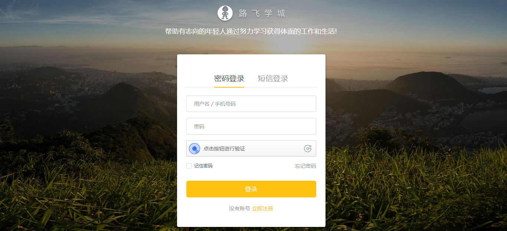
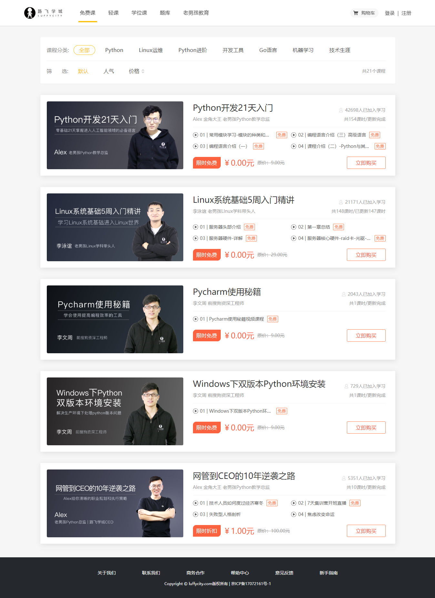
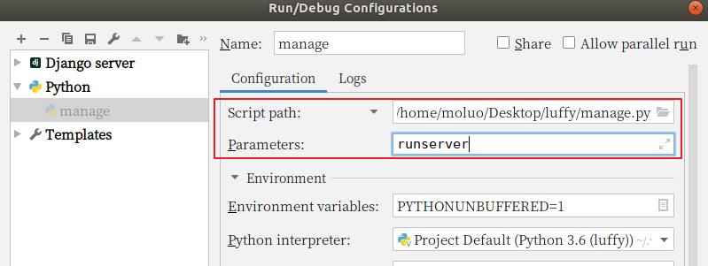
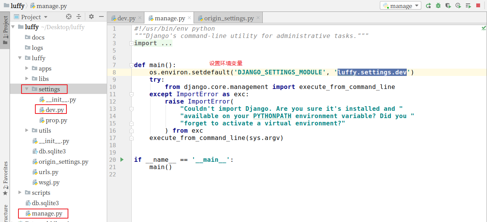
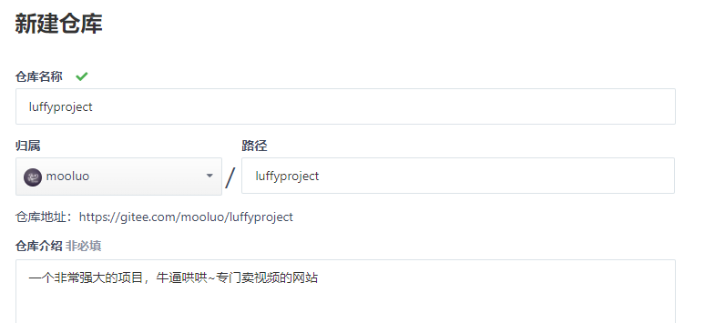
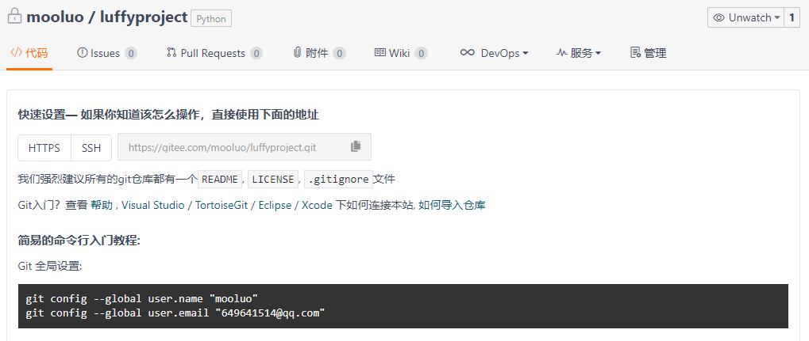
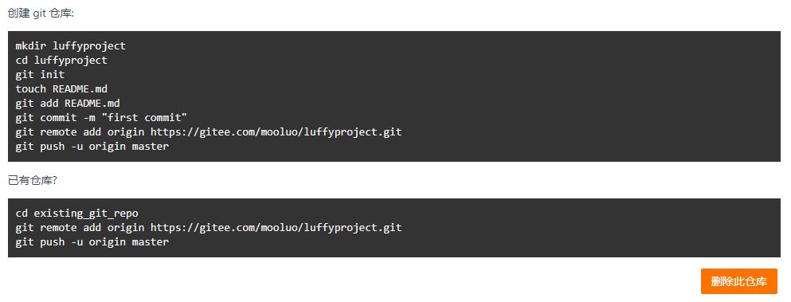
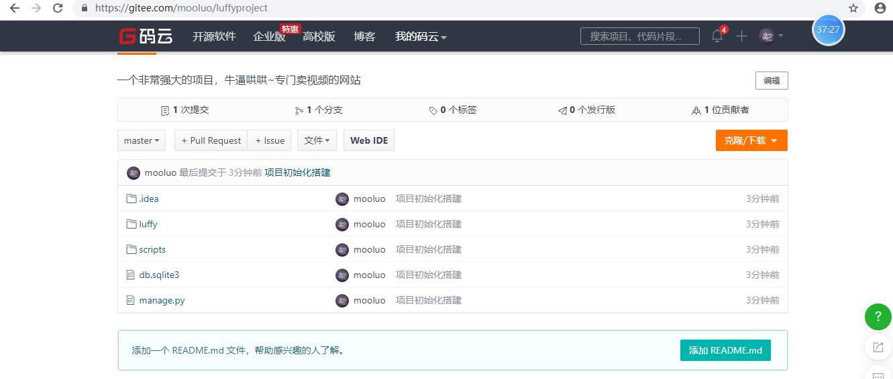
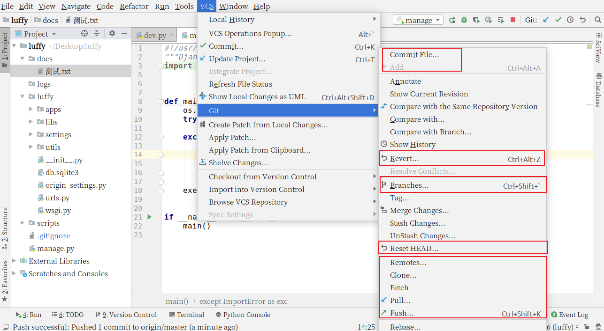

# 1. 项目开发基础概念

## 1.1 企业的web项目类型

1. 商城

   1.1 B2C  直销商城  商家与会员直接交易  ( Business To Customer )

   1.2 B2B  批发商城  商家与商家直接交易

   1.3 B2B2C   购物平台   商家和会员在另一个商家提供的平台上面进行交易

   1.4 C2B   定制商城   会员向商家发起定制商品的需求，商家去完成。

   1.5 O2O  线上线下交易平台   

   1.6 C2C   二手交易平台

2. 门户网站[企业站和门户站]

3. 社交网络

4. 资讯论坛

5. 内部系统 

6. 个人博客

7. 内容收费站

## 1.2 企业项目开发流程


## 1.3 立项申请阶段

立项其实就是对产品项目能不能做和怎么做，提出理论基础。大的互联网公司都有比较正规的立项流程。


通常公司内部要研发一款软硬件的产品之前，都要经过市场评估和调研分析，产生一份`产品项目立项报告`给公司。

产品项目立项报告一般包含以下内容：

```
项目概述
需求市场
需求分析和项目建设的必要性
业务分析
总体建设方案
项目风险和风险管理
可行性分析阶段
```

参考资料：<https://blog.csdn.net/m0_37370820/article/details/81077886>


# 2. 需求分析

## 2.1 首页

功能：导航菜单、轮播图、退出登录


## 2.2 登录注册

功能：用户登录、极验验证码、多条件登录、记住密码、短信发送、短信冷却倒计时、jwt认证




## 2.3 课程列表

功能：课程分类、课程列表、课程多条件筛选展示、课程分类展示、课程分页展示、课程章节课时展示、课程优惠策略




## 2.4 课程详情

功能：课程信息展示、视频播放、富文本编辑器


## 2.5 购物车

功能：购物车商品列表、添加商品、删除商品、勾选商品状态、商品结算、订单生成、唯一订单号生成


## 2.6 商品结算

功能：订单商品信息列表、订单信息展示、积分计算功能、优惠券策略、课程有效期计算、第三方支付平台接口


## 2.7 购买成功

功能：订单状态切换，购物课程的有效期记录


## 2.8 个人中心

功能列表：我的订单、订单状态改变


## 2.9 视频播放

功能：视频加密播放


# 3. 环境搭建

## 3.1 创建虚拟环境

```python
cd ~/Desktop
mkvirtualenv luffy
```

如果自己的开发机子中存在多个版本的python，则可以指定解析器的版本

```python
mkvirtualenv luffy -p python3
```

 


## 3.2 相关命令复习

```python
创建虚拟环境：               mkvirtualenv 虚拟环境名称
创建虚拟环境(指定python版本)： mkvirtualenv -p python3 虚拟环境名称
查看所有虚拟环境：            workon+2次tab键
使用虚拟环境：               workon 虚拟环境名称
退出虚拟环境：               deactivate
删除虚拟环境（必须先退出虚拟环境内部才能删除当前虚拟环境）:
                           	rmvirtualenv 虚拟环境名称
    
其他相关命令：
查看虚拟环境中安装的包：              pip freeze  或者 pip list
收集当前环境中安装的包及其版本：       pip freeze > requirements.txt
在部署项目的服务器中安装项目使用的模块： pip install -r requirements.txt
```

提示:

- 虚拟环境只会管理环境内部的模块和python解析器,对于源代码是毫无关系

- 创建虚拟环境需要联网
- 创建成功后, 会自动工作在这个虚拟环境上
- 工作在虚拟环境上, 提示符最前面会出现 “(虚拟环境名称)”


## 3.3 技术选型

### 外部依赖

1.  注册支付宝的开发者账号
2. 注册阿里云账号,如果可以购买一个服务器,或者第一次使用的可以申请一个免费外网服务器
3. 注册容联云短信接口平台的账号
4. 注册保利威视频服务平台的账号[先不要注册，有个免费的测试开发时间，7天]
5. 注册gitee[码云]的账号
6. 如果有条件的,可以申请一个域名进行备案[ICP备案和公安部备案],如果没有的话, 可以注册natapp

#### 依赖包安装

```
pip install django  -i https://pypi.douban.com/simple

pip install djangorestframework  -i https://pypi.douban.com/simple

pip install PymySQL  -i https://pypi.douban.com/simple

pip install Pillow  -i https://pypi.douban.com/simple

pip install django-redis  -i https://pypi.douban.com/simple
```


# 4. 搭建项目

## 4.1 创建项目

```python
cd ~/Desktop
mkdir luffy
cd luffy
django-admin startproject luffyapi
```

效果:


## 4.3 打开项目

在pycharm中打开项目


设置虚拟环境


启动django项目



效果：


提示：

```
在pycharm中如果要使用已经创建好的虚拟环境，则必须设置pycharm中的python解释器，设置为虚拟环境中的python。
```


## 4.2 调整目录

```
luffy/
  ├── docs/          # 项目相关资料保存目录
  ├── luffycity/     # 前端项目目录
  ├── luffyapi/      # api服务端项目目录
       ├── logs/          # 项目运行时/开发时日志目录
       ├── manage.py
       ├── luffyapi/      # 项目主应用，开发时的代码保存
       │    ├── apps/      # 开发者的代码保存目录，以模块[子应用]为目录保存
       │    ├── libs/      # 第三方类库的保存目录[第三方组件、模块]
       │    ├── settings/
       │         ├── dev.py   # 项目开发时的本地配置[不需要上传到线上或者服务器]
       │         ├── prod.py  # 项目上线时的运行配置
       │    ├── urls.py    # 总路由
       │    ├── utils/     # 多个模块[子应用]的公共函数类库[自己开发的组件]
       └── scripts/       # 保存项目运营时的脚本文件
```

在编辑中开发项目时,必须指定项目目录才能运行,例如,开发后端项目,则必须选择的目录是luffyapi


### 4.2.1 分不同环境进行项目配置

开发者本地的环境、目录、数据库密码和线上的服务器都会不一样,所以我们的配置文件可以针对不同的系统分成多分.

1. 在项目主应用下,创建一个settings的配置文件存储目录
2. 根据线上线下两种情况分别创建2个配置文件 dev.py和prod.py
3. 把原来项目主应用的 settings.py配置内容复制2份到dev.py和prod.py里面
4. 把原来的settings.py配置文件修改文件名或者删除

新的目录settings:


接下来,就可以根据在manage.py中根据不同的情况导入对应的配置文件了.




## 4.3 创建代码版本

cd进入到自己希望存储代码的目录路径，并创建本地仓库.git【pycharm直接打开终端就是项目根目录了。无须cd了】
新创建的本地仓库.git是个空仓库

```python
cd 目录路径
git init
```


### 4.3.1 配置用户名和邮箱

```
git config --global user.name 'lisi'
git config --global user.email 'lisi@163.com'
```


## 4.4 在git平台创建工程

公司一般都会有自己的代码仓库，一般都是自己搭建，也有使用第三方提供代码管理平台。

常用的代码管理平台：github、gitee(码云)

如果公司自己搭建的代码管理平台，gitlab框架

1） 创建私有项目库




创建私有空仓库以后的界面:





2）克隆项目到本地

```python
注意：
	我们当前项目不需要这个步骤
    这个步骤是 当以后我们进入公司里面，参与人家已经在做的项目时，别人已经有仓库了，但是我们是新人加入项目中的，那么我们不需要在自己本地进行git init，直接git clone 复制别人的仓库代码
```


```
git clone 仓库地址
注意，如果当前目录下出现git仓库同名目录时，会克隆失败。
```


3）创建并切换分支到dev

```
# git branch dev      # 创建本地分支dev,dev是自定义
# git checkout dev    # 切换本地分支代码
git checkout -b dev   # 这里是上面两句代码的简写
```


git提交

```shell
git add 代码目录   # 添加代码到上传队列
git status        # 查看当前项目的版本状态
git commit -m '添加项目代码'  # 提交代码到本地仓库， -m 表示本次提交的描述
```

推送到远端

```shell
git push origin dev:dev
```

如果推送代码,出现以下提示: git pull ....,则表示当前本地的代码和线上的代码版本不同.

```
1. 把线上的代码执行以下命令,拉取到本地,进行同步
git pull

2. 根据提示,移除多余的冲突的文件,也可以删除.
完成这些步骤以后,再次add,commit,push即可.
```


接下来，我们就把上面创建好的本地项目提交到gitee码云上面

```bash
# .表示当前目录下所有的文件或目录提交到上传队列[上传队列也叫"暂存区"]
git add .

# 把本地上传队列的代码提交到本地仓库
git commit -m "项目初始化搭建"

# 给本地的git版本控制软件设置项目的远程仓库地址
git remote add origin https://gitee.com/mooluo/luffyproject.git

# 提交代码给远程仓库
git push -u origin master
```


```
扩展：
1. 通过 git status 可以查看当前项目的代码版本状态
2. 通过 git reflog 可以查看代码版本日志[简单格式]
3. 通过 git log    可以查看代码版本日志[详细格式]
```

最终，成功提交了代码版本到gitee平台。效果：



上面虽然成功移交了代码版本，但是一些不需要的文件也被提交上去了。

所以，我们针对一些不需要的文件，可以选择从代码版本中删除，并且使用`.gitignore`把这些垃圾文件过滤掉。

```bash
git rm 文件  # 删除单个文件
git rm -rf 目录  # 递归删除目录

# 以下操作建议通过ubuntu的终端来完成，不要使用pycharm提供，否则删除.idea还会继续生成。
git rm -rf .idea
git rm db.sqlite3
# 注意，上面的操作只是从项目的源代码中删除，但是git是不知情的，所以我们需要同步。
git add .
git commit -m "删除不必要的文件或目录"
git push -u origin master
```

使用``.gitignore``把一些垃圾文件过滤掉。

```
vim .gitignore

./idea
./idea/*
./git
./db.sqlite3
```

开发时我们经常会使用pycharm的提供的git管理工具来完成代码的拉取和推送。




