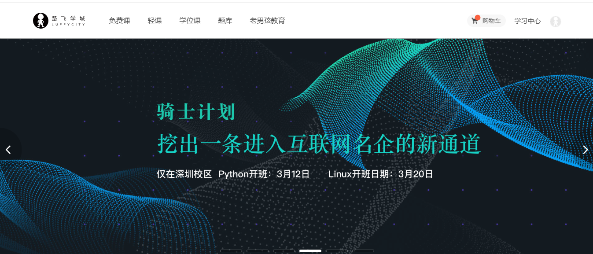
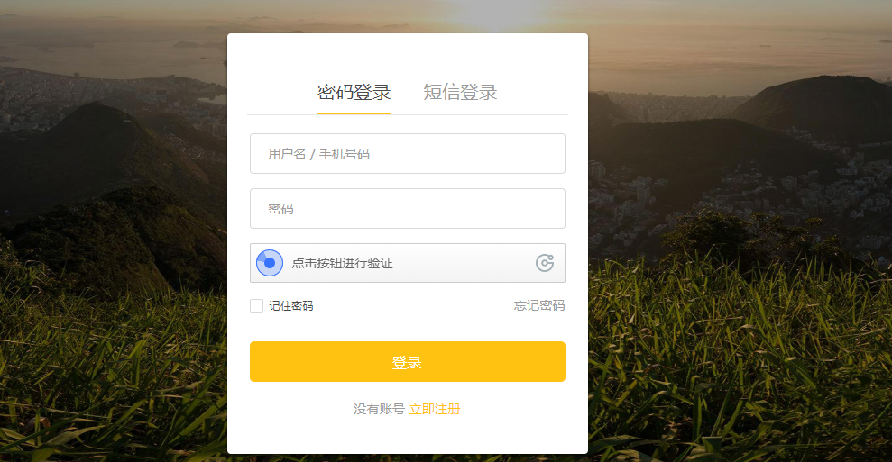
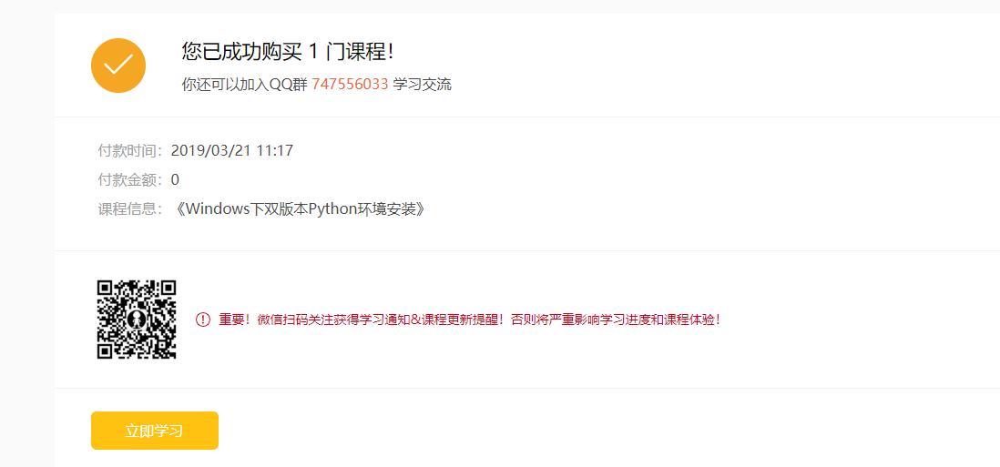
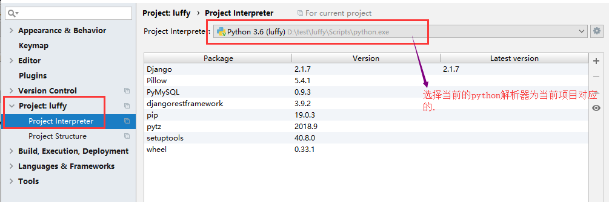
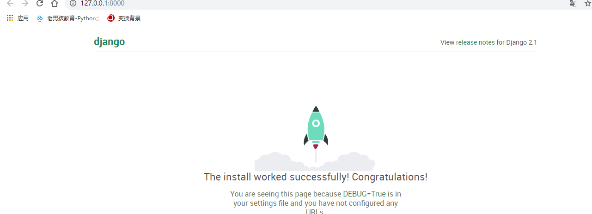

# 1. 项目开发前

## 1.1 虚拟环境virtualenv

如果在一台电脑上, 想开发多个不同的项目, 需要用到同一个包的不同版本, 如果使用上面的命令, 在同一个目录下安装或者更新, 新版本会覆盖以前的版本, 其它的项目就无法运行了.而公司里面往往会存在多个项目的情况，所以需要使用虚拟环境，把当前项目所需要用到的模块及其版本进行隔离包装到一个虚拟环境中使用。

### 1.1.1 安装

```shell
pip install virtualenv -i https://pipy.douban.com/simple     
pip install virtualenv-clone -i https://pipy.douban.com/simple
pip install virtualenvwrapper -i https://pipy.douban.com/simple
pip install virtualenvwrapper-win -i https://pipy.douban.com/simple

# 注意以上命令适用于window系统
```

### 1.1.2 常用命令

```python
创建虚拟环境：                mkvirtualenv 虚拟环境名称
创建虚拟环境(指定python版本)： mkvirtualenv -p python 虚拟环境名称
查看所有虚拟环境：            workon+2次tab键
使用虚拟环境：               workon 虚拟环境名称
退出虚拟环境：               deactivate
删除虚拟环境（必须先退出虚拟环境内部才能删除当前虚拟环境）:
                           	rmvirtualenv 虚拟环境名称
    
其他相关命令：
查看虚拟环境中安装的包：              pip freeze  或者 pip list
收集当前环境中安装的包及其版本：       pip freeze > requirements.txt
在部署项目的服务器中安装项目使用的模块： pip install -r requirements.txt
```

提示:

+ 虚拟环境只会管理环境内部的模块和python解析器,对于源代码是毫无关系

- 创建虚拟环境需要联网
- 创建成功后, 会自动工作在这个虚拟环境上
- 工作在虚拟环境上, 提示符最前面会出现 “(虚拟环境名称)”


## 1.2 企业项目开发流程

企业的web项目类型:

1. 商城

   B2C  直销/直营商城  Business To Customer  企业 与 客户 的交易模型

   C2C  二手商城  Customer  To Customer  

   C2B  定制商城  

   B2B2C  购物平台

   B2B  批发商城  

2. 门户网站[企业站和门户站]

3. 社交网络

4. 资讯论坛

5. 内部系统 OA, CRM, ERM, ERP

6. 个人博客

7. 内容收费站


前端的静态页面制作,外界开发的时候,是照着psd/png设计稿进行切图布局

## 1.3 需求分析

### 首页

导航信息/轮播图片/购物车/登录判断




### 免费课

课程分类/筛选条件/


### 免费课详情页

视频播放/课程章节/学生评论/倒计时/添加商品到购物车/


### 登录

#### 账号登录

多条件登录

极验验证码接口

忘记密码

保存密码



#### 短信登录

发送短信接口[ 容联云短信接口 ]

短信冷却倒计时


### 免费试学


### 购物车

购物车中课程的关联和核算功能

优惠券管理

我的贝里[积分]

支付宝功能的接入

生成订单[订单号\订单价格\订单商品标题]


### 购买成功页面

从支付宝服务器上面获取订单状态




### 后台管理 xadmin


## 1.4 项目架构

- 项目采用前后端分离的应用模式
- 前端使用Vue.js                                     vue-cli
- 后端使用Django REST framework


# 2. 搭建DRF项目

#### 进入虚拟环境

workon luffy

#### 安装基本类库

在之前虚拟环境luffy中安装项目需要用到的类库

```
pip install django

pip install PymySQL

pip install Pillow

pip install djangorestframework
```

#### 创建django项目

```python
django-admin startproject luffy
```

效果:


#### 在pycharm中打开项目




提示：

在pycharm中如果要使用已经创建好的虚拟环境，则必须设置pycharm中的python解释器，设置为

虚拟环境中的python。

/.virtualenvs/环境名称/Scripts/python.exe


访问浏览器查看效果:




# 3. 项目配置

## 3.1 项目目录调整

```
├── docs           # 项目相关资料保存目录
├── logs           # 项目运行时/开发时日志目录
├── manage.py
├── luffy         # 开发时的代码保存
│   ├── apps       # 开发者的代码保存目录，以模块[子应用]为目录保存
│   ├── libs       # 第三方类库的保存目录
│   ├── settings.py
│   ├── urls.py
│   ├── utils      # 多个模块[子应用]的公共函数类库
└── scripts        # 保存项目运营时的脚本文件
```


## 3.2 创建数据库

```mysql
create database luffycity default charset=utf8;
```

为当前项目创建数据库用户[这个用户只能看到这个数据库]

```mysql
create user luffy_user identified by 'luffy';
grant all privileges on luffycity.* to 'luffy_user'@'%';
flush privileges;
```


## 3.3 配置数据库连接

打开settings/dev.py文件，并配置

```python
DATABASES = {
    "default": {
        "ENGINE": "django.db.backends.mysql",
        "HOST": "127.0.0.1",
        "PORT": 3306,
        "USER": "luffy_user",
        "PASSWORD": "luffy",
        "NAME": "luffycity",
    }
}
```


在项目主模块的 `__init__.py`中导入pymysql

```python
import pymysql

pymysql.install_as_MySQLdb()
```


## 3.4 日志配置

在settings.py文件中追加如下配置：

```python
LOGGING = {
    'version': 1,
    'disable_existing_loggers': False,
    'formatters': {
        'verbose': {
            'format': '%(levelname)s %(asctime)s %(module)s %(lineno)d %(message)s'
        },
        'simple': {
            'format': '%(levelname)s %(module)s %(lineno)d %(message)s'
        },
    },
    'filters': {
        'require_debug_true': {
            '()': 'django.utils.log.RequireDebugTrue',
        },
    },
    'handlers': {
        'console': {
            'level': 'DEBUG',
            'filters': ['require_debug_true'],
            'class': 'logging.StreamHandler',
            'formatter': 'simple'
        },
        'file': {
            'level': 'INFO',
            'class': 'logging.handlers.RotatingFileHandler',
            'filename': os.path.join(os.path.dirname(BASE_DIR), "logs/luffy.log"),
            'maxBytes': 300 * 1024 * 1024,
            'backupCount': 10,
            'formatter': 'verbose'
        },
    },
    'loggers': {
        'django': {
            'handlers': ['console', 'file'],
            'propagate': True,
        },
    }
}
```


## 3.5 异常处理

新建utils/exceptions.py

```python
from rest_framework.views import exception_handler

from django.db import DatabaseError
from rest_framework.response import Response
from rest_framework import status

import logging
logger = logging.getLogger('luffy')


def custom_exception_handler(exc, context):
    """
    自定义异常处理
    :param exc: 异常类
    :param context: 抛出异常的上下文
    :return: Response响应对象
    """
    # 调用drf框架原生的异常处理方法
    response = exception_handler(exc, context)

    if response is None:
        view = context['view']
        if isinstance(exc, DatabaseError):
            # 数据库异常
            logger.error('[%s] %s' % (view, exc))
            response = Response({'message': '服务器内部错误'}, status=status.HTTP_507_INSUFFICIENT_STORAGE)

    return response
```


settings.py配置文件中添加

```python
REST_FRAMEWORK = {
    ...
  
    # 异常处理
    'EXCEPTION_HANDLER': 'luffy.utils.exceptions.custom_exception_handler',
}
```

